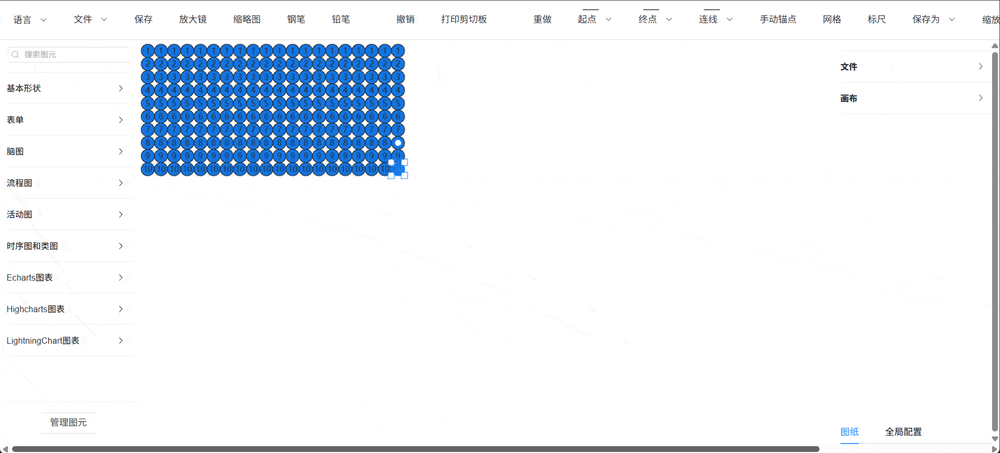

# @meta2d/vue
Vue 声明式UI的方式使用meta2d，暂不稳定，请谨慎使用
# example
```vue
<script setup>
import {Meta2dComponent} from "@meta2d/vue"
import {onMounted, reactive} from "vue";

const circleData = reactive({
  background:"#1376e4"
})

onMounted(()=>{
  setTimeout(()=>{
    circleData.background = '#00ff00'
    setTimeout(()=>{
      circleData.background = '#ff0000'
    },4000)
  },4000)
})

const data = reactive(new Array(10).fill(0).map(()=>({
  visible:true
})))
</script>

<template>
  <div class="main">
    <Meta2dComponent style="width: 100%;height: 100%">
      <template v-for="row in 20" :key="row">
        <template v-for="(i,index) in data" :key="index">
          <circle
              :text="index"
              :x="(row - 1) * 20 + 100"
              :y="(index - 1) * 20 + 100"
              :width="20"
              :height="20"
              :background="circleData.background"
              @click="()=>i.visible = !i.visible"
              v-if="i.visible"
          >
          </circle>
        </template>
      </template>
    </Meta2dComponent>
  </div>
</template>

```

